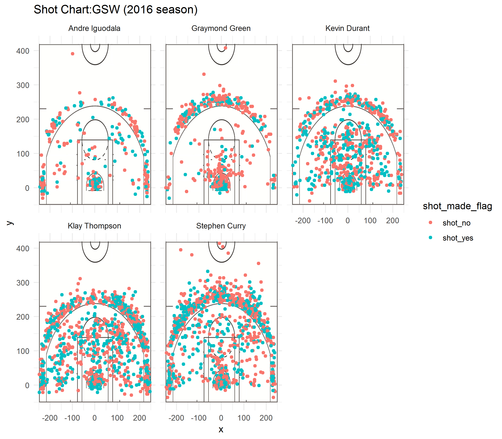

## **We are the champion!**
Last season, when they lost the final championship, the warriors fell from the altar. 
However, those warriors have naver been depressed. Last summer, they sent half of the original team in order to sign Durant in a fierce battle, thus creating a 4 that shocked the league.After that, the Golden State Warriors experienced a slow start, experienced Curry's downturn and Durant's injury, and a series of losing. But relying on a strong resilience and the intelligence of Steve Kerr, they finally cracked the dilemma, won at least 65 games in the third consecutive season, locked the regular season championship,and achieved a perfect reshap. 


## **stat**
### *2016-2017 Firts lineups*
*Klay Thompson* 

(https://www.basketball-reference.com/players/t/thompkl01.html)

*stephen Curry* 

(https://www.basketball-reference.com/players/c/curryst01.html)

*Kevin Durant*

(https://www.basketball-reference.com/players/d/duranke01.html)

*Draymond Green*

(https://www.basketball-reference.com/players/g/greendr01.html)

*Andre Iguodala* 

(https://www.basketball-reference.com/players/i/iguodan01.html)

## *Field Goal Statistic*

2016-2017 may be one of the most glorious moment of Golden State Warriors,the top stars Stephen Curry and Kevin Durant became a most worthy player of NBA history.
However, if we just look at the  effeciency of shooting, maybe other players also have excellent performance.

Before we start analysing the shooting effeciency, let's have a look at the shooting position habit of each player. How long  are the their best shooting distances? and where can they get most points?

*Andre Iguodala*
 Iguodala is familiar with the left part of the court,where he made most of his shooting attempt and get the points. He also like to shoot near the 3 point line and near the basket.

*Graymoon Green*
 
 Although as a power forward, his main task is not scoring, we can tell he still make a lot of attempts.The positions where he usually shoot have obvious feature. He like to shoot in hte middle and he also made many rebound near the board.

*Kevin Durant* 
 
 Kevin Durant is only famous for his fancy motions and brilliant control ability, but also good at scoring. The power forward can score at nearly all position, but right part is his favourite.

*Klay Thompson*
 
 As a shooting guard,Klay Thompson is a very holistic shooting weapon of warrior. You can see him score at almost everywhere at the opponents' court.

*Stephen Curry*

Another top star of the team contribute nearly 30% of the total FPA. Also excelling at nearly all the position, but he is known for shooting near the thre-point line.Moreover, he is able to shoot at a very long distance,and the right part seem to be more comfortable for him to shoot.


```{r out.width='80%',echo=FALSE,fig.align='center'}

```

###**Total shooting efficiency** 

Then let's have a look at  total shooting effeciency.
From the table we can see top star of warriors--Durant rank first amnong the starting lineup. Due to his strong physical quality&flexibility,he can easily pass their opponent.Andre Iguodala follow Durant rank 2, but from the chart we can tell he has the lowest FPA which means he can not always made the shoot.
Surprisingly, Stephen Curry only rank 4th in this table,but he contribute the most of points of the team. A total 584 field goal rank 1st among all his teammates.

**Effective Shooting % by Player**

```{r echo=FALSE}
 
library(dplyr)
shots_data <- read.csv("../data/shots-data.csv",stringsAsFactors = FALSE)
teff <-  summarize(group_by(shots_data,name),total=length(name),made=sum(shot_made_flag=="shot_yes"),perc_made=made/total)%>%arrange(desc(perc_made))
teff
```
Then let's see the chart of FGA and FG
Undoubtly, Stephen Curry again win the first place,followed by Thompson with a slight difference. There are 3 player exceed the average line.


```{r echo=FALSE}
library(ggplot2)
ggplot(teff)+geom_col(aes(x=name,y=total,fill="red"))+geom_col(aes(x=name,y=made))+geom_hline(aes(yintercept=mean(made)))+labs(x="Player",y="points",title="Total FGA and FG by GSW player")
```

###**2 points shooting effeciency**

There isn't a big change in the rank, but Iguadala exceed Durant by 3%, with the 63% shooting accuracy rank 1st. The other player has over 60% 2 points shooting accuracy is Durant. With 2.08m height, he can easily make slam dunk.

 
**2PT Effective Shooting % by Player**


```{r echo=FALSE }

pt2 <- filter(shots_data,shot_type=="2PT Field Goal")
pt2eff <- summarize(group_by(pt2,name),total=length(name),made=sum(shot_made_flag=="shot_yes"),perc_made=made/total)%>%arrange(desc(perc_made))
pt2eff


```

From the barchat we can see Kevin durant rank 1st in both 2 points attempts and 2 points goals, which make him the best 2 points scorer in golden state warriors. Thompason follow Durant rank 2, with 3 less attempts, but as for the shooting efficency, he can not compare with Durant.

```{r echo=FALSE}
ggplot(pt2eff)+geom_col(aes(x=name,y=total,fill="red"))+geom_col(aes(x=name,y=made))+geom_hline(aes(yintercept=mean(made)))+labs(x="Player",y="points",title="2PA and 2P by GSW player")
```


###**Three points shooting efficiency**

Finally,we should have a look at the three points shooting efficiency.
Talking about 3 points goals, we have to mention the 2 pointing guard in Golden State Warrious--Klay Thompson and Stephen Curry.As the top three points shooter of the league, they will never disappointed us. Both of them have more than 40% goal percentage, and klay Thompson reach 42.4%,which is an amazing number.

Besides, Kevin Durant also has an outstanding performance in 3 points goal, with an 38.6% goal percentage, he deserve title of the most comprehensive player in the league.

**3PT Effective Shooting % by Player**

```{r echo=FALSE }

pt3 <- filter(shots_data,shot_type=="3PT Field Goal")
pt3eff <- summarize(group_by(pt3,name),total=length(name),made=sum(shot_made_flag=="shot_yes"),perc_made=made/total)%>%arrange(desc(perc_made))
pt3eff
```


Then, from the chart we can see the number of 3 points attempts and goals achieved by each player. Stephen Curry rank 1st and contribute more than 1/3 of the 3 points goals in the team, which prove his value as a shooting guard.Klay Thompson follows him ranks 2nd. However, this time only 2 player pass the average line, which prove the division of duty of Golden State Warriors is clear and the collaboration is excellent.
```{r echo=FALSE}
ggplot(pt3eff)+geom_col(aes(x=name,y=total,fill="red"))+geom_col(aes(x=name,y=made))+geom_hline(aes(yintercept=mean(made)))+labs(x="Player",y="points",title="3PA and 3P by GSW player")
```


##**Summary**
**The data tables and charts above show us the goal percentage and total goals of each players. If we just view the players from this perspective, maybe Durant, Thompson and Curry stand out a lot. However, basketball is not only the art of shooting balls, the reason why Warriors win the final championship is not just because they have the shooters, but their amazing collaborations.**

##**Reference**

(https://www.basketball-reference.com/teams/GSW/2017.html)

(https://sportsknowhow.com/basketball/dimensions/nba-basketball-court-dimensions.html)

(https://www.foxsports.com/nba/story/5-reasons-the-2016-17-golden-state-warriors-are-the-greatest-team-of-all-time-061517)

(http://sports.sohu.com/s2017/7265/s487364357/)